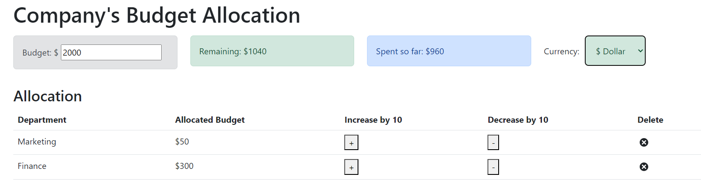

# Alloc8 💸 - Master Your Budget with Ease

# Overview

Welcome to **Alloc8** – a smart and intuitive budget allocation app. This project was originally based on source code provided by IBM, but I have made several enhancements and modifications to get it up and running smoothly. Alloc8 helps you manage your finances by tracking your budget and expenses in real time. It’s built using React and leverages a clean and straightforward user interface.

 

# Technologies Used

  

 

# Installation
To get a local copy up and running, follow these simple steps:

<table>
  <thead>
    <tr>
      <th>Step</th>
      <th>Command</th>
    </tr>
  </thead>
  <tbody>
    <tr>
      <td>Clone the repo:</td>
      <td><pre><code>https://github.com/harshilshrma/alloc8.git</code></pre></td>
    </tr>
    <tr>
      <td>Navigate to the project directory:</td>
      <td><pre><code>cd alloc8</code></pre></td>
    </tr>
    <tr>
      <td>Install the dependencies:</td>
      <td><pre><code>npm install</code></pre></td>
    </tr>
    <tr>
      <td>Start the development server:</td>
      <td><pre><code>npm start</code></pre></td>
    </tr>
  </tbody>
</table>

 

# Features

This project includes the following features:
<ul>
    <li><strong>Dynamic Budget Tracking:</strong> Update and track your budget in real-time.</li>
    <li><strong>Expense Management:</strong> Add, reduce, or delete expenses with ease.</li>
    <li><strong>Currency Support:</strong> Select and update your preferred currency.</li>
    <li><strong>Alerts:</strong> Receive alerts when your budget constraints are exceeded.</li>
</ul>

 

# Changes and Enhancements

Here are the changes made to the original IBM source code to enhance Alloc8:

<table>
  <thead>
    <tr>
      <th>File</th>
      <th>Original Code</th>
      <th>Changes Made</th>
    </tr>
  </thead>
  <tbody>
    <tr>
      <td><strong>budget.js</strong></td>
      <td>Handled budget display and updates.</td>
      <td>
        <ul>
          <li>Added validation to ensure the budget does not exceed a specified limit or fall below the remaining amount.</li>
          <li>Included currency symbol extraction and dynamic display.</li>
        </ul>
      </td>
    </tr>
    <tr>
      <td><strong>remaining.js</strong></td>
      <td>Displayed remaining budget.</td>
      <td>
        <ul>
          <li>Added dynamic alert types based on whether the total expenses exceed the budget.</li>
          <li>Extracted and displayed the currency symbol.</li>
        </ul>
      </td>
    </tr>
    <tr>
      <td><strong>expenseTotal.js</strong></td>
      <td>Summarized total expenses.</td>
      <td>
        <ul>
          <li>Added currency symbol extraction and dynamic display.</li>
        </ul>
      </td>
    </tr>
    <tr>
      <td><strong>expenseItem.js</strong></td>
      <td>Displayed individual expense items.</td>
      <td>
        <ul>
          <li>Added buttons for increasing and decreasing expense allocations.</li>
          <li>Implemented dynamic currency symbol display.</li>
          <li>Handled expense deletion with confirmation.</li>
        </ul>
      </td>
    </tr>
    <tr>
      <td><strong>expenseList.js</strong></td>
      <td>Rendered the list of expense items.</td>
      <td>
        <ul>
          <li>Added table structure for better readability and interaction.</li>
        </ul>
      </td>
    </tr>
    <tr>
      <td><strong>allocationForm.js</strong></td>
      <td>Form for adding expenses.</td>
      <td>
        <ul>
          <li>Included validation to ensure new expenses do not exceed remaining funds.</li>
          <li>Added options for both increasing and reducing allocations.</li>
          <li>Integrated currency symbol display.</li>
        </ul>
      </td>
    </tr>
    <tr>
      <td><strong>app.js</strong></td>
      <td>Main application structure.</td>
      <td>
        <ul>
          <li>Integrated all components with a cohesive layout.</li>
          <li>Added support for currency selection and updates.</li>
        </ul>
      </td>
    </tr>
    <tr>
      <td><strong>appContext.js</strong></td>
      <td>Managed global state using context and reducer.</td>
      <td>
        <ul>
          <li>Added actions for setting the budget, changing currency, and managing expenses.</li>
          <li>Implemented new logic for adding and reducing expenses.</li>
          <li>Ensured budget and remaining funds are consistently updated.</li>
        </ul>
      </td>
    </tr>
  </tbody>
</table>

# Learnings

Here are the key learnings from the Alloc8 project:
<ul>
    <li><strong>React State Management:</strong> Mastered state management using React's context and hooks.</li>
    <li><strong>Component-based Architecture:</strong> Improved understanding of component-based architecture in React.</li>
    <li><strong>Form Handling:</strong> Gained experience with form handling and validation in React.</li>
    <li><strong>Dynamic Updates:</strong> Implemented dynamic updates for budget tracking and expense management.</li>
    <li><strong>Responsive Design:</strong> Ensured the application works seamlessly across various devices and screen sizes.</li>
</ul>

 

# Conclusion

Thank you for checking out Alloc8, your new best friend for budget management! This project dives deep into React, state management, and creating an interactive user experience. 

Feel free to explore the code, contribute, or use it for your personal projects. Your feedback and contributions are always welcome.

  

  Happy budgeting! 💸📊

